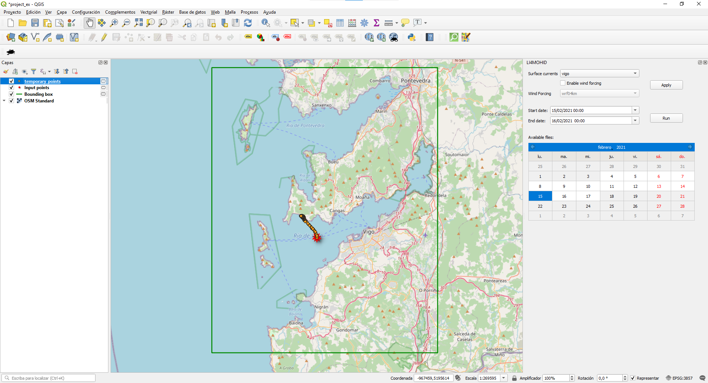

# LI4MOHID

LI4MOHID is a free and open source [QGIS](https://qgis.org/) plug-in to help researchers and practitioners with their
[MOHID Lagrangian](http://www.mohid.com/pages/models/mohidlagrangian/mohid_lagrangian_home.shtml) modelling workflow. 
LI4MOHID can be used to  input data, run simulations, and visualize results. 

This plug-in has been developed under [MyCOAST](http://www.mycoast-project.org) project.

A screenshot of LI4MOHID in QGIS

## Requierements

In order to use the plug-in, is required to have installed:

* **QGIS:** QGIS 3.10 LTR is recommended but the plug-in works from 3.8 and up.
* **Lagrangian MOHID:** The lagrangian MOHID model to be executed by the plug-in. The last release
can be downloaded from [MOHID Lagrangian Github site](https://github.com/Mohid-Water-Modelling-System/MOHID-Lagrangian/tags).
  To install it, just download the release folder to your local computer.
  
## Installation

1. Install NetCDF4 and vtk libraries for Python QGIS. To install them we recommend the following steps:
    1)	Open OSGeo4W Shell
    2)	Path update, using “py3_env”.
    3)	In https://www.lfd.uci.edu/~gohlke/pythonlibs/ 
download:
          
        -	cftime-1.0.4-cp37-cp37m-win_amd64.whl
        -	netCDF4-1.5.3-cp37-cp37m-win_amd64.whl
        -	VTK-8.2.0-cp37-cp37m-win_amd64.whl
    4) Install these three packages with
       
            pip install package.whl

2. Install the plug-in.

Download the li4mohid folder  and copy to C:\OSGeo4W64\apps\qgis\python\plugins folder. 
Open QGIS, click tab “Complements/Manage and install plugins”, select “LI4MOHID” and activate.
An “oil-spill” icon must appear in the toolbar.

## Usage

For usage, please, consult the main [documentation](./doc/MyCoast_LI4MOHID_EN.pdf) 

## Credits
* *author:*
  + Carlos F. Balseiro (4Gotas, cfbalseiro@4gotas.com)
  + Pedro Montero (INTECMAR, pmontero@intecmar.gal)
* *license:* Copyright (c) INTECMAR 2020. Licensed under MIT
* *funding:* MYCOAST  Interreg Atlantic Programme, Project nr. EAPA 285/2016
             http://www.mycoast-project.org
  

